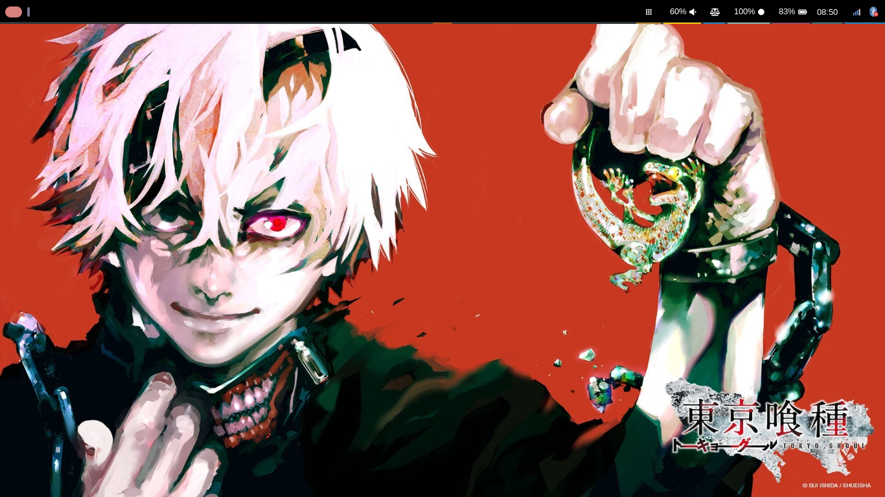

## Neo

My collection of Linux configurations :P

## Screenshots
###### Desktop

###### Waybar 

## My Setup

| User | Application |
|:-----------:|:----:|
| Distro | Arch Linux |
| Window Manager | Niri - Hyprland |
| Login Manager | Ly |  // Lemurs //
| Status Bar | Waybar |
| Wallpaper | Awww |
| Notification Manager | Dunst |
| File Manager | Yazi |
| App Launcher | Fuzzel |
| Text Editor | Obsidian |
| Snapshots | Snapper |
| Torrent | Deluge |
| Browser | Zen - Helium - Firefox |

| System | Application |
|:-----------:|:----:|
| Bootloader | Limine |
| Storage | Btrfs |
| Sound | Pipewire |
| Network | Iwd |
| Boot Image | Plymouth |

| Terminal | Application |
|:--------------:|:------------:|
| Terminal Emulator | Alacritty - Kitty |
| Shell | Nushell |
| Fetch | Fastfetch |
| Prompt | Starship |
| Editor | Helix |

| Development | Application |
|:--------------:|:------------:|
| Code Editor | Zed |
| Git | Gitte - Gitbutler |

| Gaming | Application |
|:--------------:|:------------:|
| Store | Steam - Epic Games |
| Launcher | Hydra |
| Tool | Wine - Proton |

## Thank you to  and  for their settings, which were a great source of inspiration for me on this project ❤️
